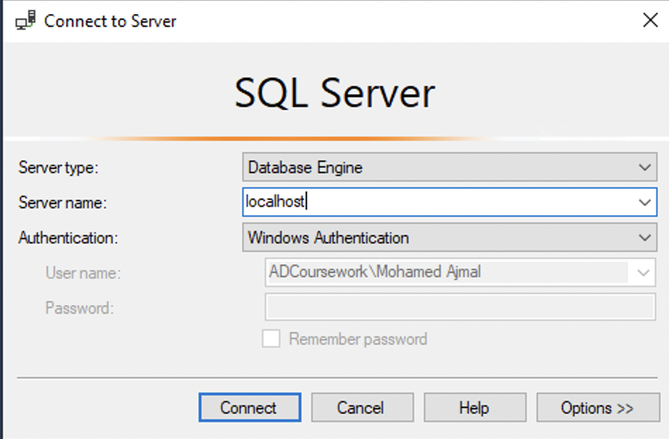
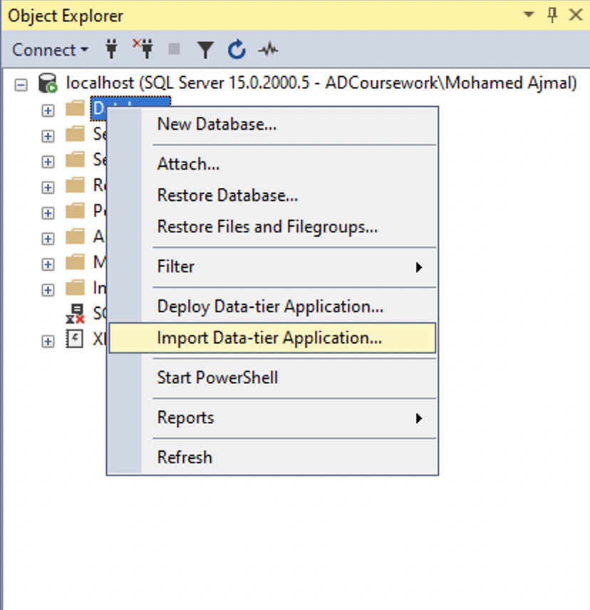

# Table of Contents

1. [e-Shift Household Goods Transportation Management System](#e-shift-household-goods-transportation-management-system)
   - [Key Features](#key-features)
   - [System Components](#system-components)
      - [Admin Dashboard](#admin-dashboard)
      - [Customer Dashboard](#customer-dashboard)
2. [Installation Guide](#installation-guide)
   - [Database Configuration](#database-configuration)
3. [User Interface Screenshots](#user-interface-screenshots)
   - [Admin Interface](#admin-interface)
      - [Login UI](#login-ui)
      - [Admin Dashboard UI](#admin-dashboard-ui)
      - [Admin Add Products UI](#admin-add-products-ui)
      - [Admin Accept/Deny Job UI](#admin-acceptdeny-job-ui)
      - [Admin Products UI](#admin-products-ui)
      - [Admin All Transport UI](#admin-all-transport-ui)
      - [Admin Create Load UI](#admin-create-load-ui)
      - [Admin Create Admin Account UI](#admin-create-admin-account-ui)
      - [Admin Manage Customer UI](#admin-manage-customer-ui)
      - [Admin Add Transport UI Pop-up](#admin-add-transport-ui-pop-up)
   - [Customer Interface](#customer-interface)
      - [Customer Dashboard UI](#customer-dashboard-ui)
      - [User Add Jobs UI](#user-add-jobs-ui)
      - [User Job History UI](#user-job-history-ui)

# e-Shift Household Goods Transportation Management System

e-Shift Household Goods Transportation Management System is a comprehensive software solution designed to automate and streamline the day-to-day operations of e-Shift, a household goods shifting company. The system provides two main dashboards: the Admin Dashboard and the Customer Dashboard. These dashboards cater to the different needs of the company, its administrators, and its customers.

## Key Features

-   **Admin Dashboard**: Manage jobs, products, transport units, and user accounts.
-   **Customer Dashboard**: Request jobs, view job history and status, and update personal information.

## System Components

### 1. Admin Dashboard

The Admin Dashboard provides a centralized interface for managing all aspects of e-Shift's operations, including:

-   **Job Management**: Review, accept or deny job requests, and assign transport units to approved jobs.
-   **Product Management**: Create and manage a list of selectable products for customers to choose from.
-   **Transport Unit Management**: Add and manage transport units, including lorries, drivers, assistants, and containers.
-   **User Management**: Add and manage admin accounts and customer accounts, including access permissions and profile information.
-   **Data Management**: Access and manage all company data, such as job details, customer information, and transport unit allocations.

### 2. Customer Dashboard

The Customer Dashboard allows customers to interact with the system and manage their personal information and job requests:

-   **Job Request**: Customers can request a job by selecting products and providing pick-up and delivery details.
-   **Job History**: View a list of all previous jobs, including their status and relevant details.
-   **Job Status**: Track the progress of ongoing jobs in real-time.
-   **Profile Management**: Update personal information, contact details, and account settings.

# Installation Guide

Follow these steps to install and configure the SQL Server Management Studio and restore the database:

## Database Configuration

1.  Download and install the SQL Server Management Studio from the following link: [https://aka.ms/ssmsfullsetup](https://aka.ms/ssmsfullsetup)
    
2.  After installing the SQL Server Management Studio, open the Azure Data Studio and click on "Deploy a Server."
    
3.  Select "SQL Server on Windows."
    
4.  Select "Basic" and let it install. After it is installed, open the Microsoft SQL Server Management Studio application.
    
5.  When prompted with the "Connect to Server" window, type in the server name as `localhost` and click the "Connect" button.
    
    
    
6.  After connecting, click on the `>` button next to your connection on the left side of the application. You'll be shown with subfolders. Right-click on the "Databases" folder and click "Restore Database."
    
    
    
7.  The "Restore Database" window will open. Click the "Device" radio button and then click the "..." (3 dots) button.

	

9.  After clicking the "..." (3 dots) button, you'll get a "Select Backup Devices" dialog box. Click the "Add" button and select the `Database.bak` file.
    
    
    
10.  After selecting the backup file, click the "OK" button in the "Select Backup Devices" dialog box and then click the "OK" button in the "Restore Database" window.

## User Interface Screenshots

### Admin Interface

#### 1. Login UI

_The login interface allows both administrators and customers to sign in to their respective dashboards._

#### 2. Admin Dashboard UI

_The Admin Dashboard provides access to job management, product management, transport unit management, user management, and data management features._

#### 3. Admin Add Products UI

_The Admin Add Products UI allows administrators to add new products and manage existing ones._

#### 4. Admin Accept/Deny Job UI

_The Admin Accept/Deny Job UI enables administrators to review incoming job requests and either accept or deny them._

#### 5. Admin Products UI

_The Admin Products UI allows administrators to view and manage all available products._

#### 6. Admin All Transport UI

_The Admin All Transport UI enables administrators to view and manage all transport units._

#### 7. Admin Create Load UI

_The Admin Create Load UI allows administrators to create and manage load assignments for transport units._

#### 8. Admin Create Admin Account UI

_The Admin Create Admin Account UI enables administrators to add and manage other admin accounts._

#### 9. Admin Manage Customer UI

_The Admin Manage Customer UI allows administrators to view and manage customer accounts._

#### 10. Admin Add Transport UI Pop-up

_The Admin Add Transport UI Pop-up enables administrators to add new transport units._

### Customer Interface

#### 1. Customer Dashboard UI

_The Customer Dashboard enables customers to request jobs, view job history and status, and update their personal information._

#### 2. User Add Jobs UI

_The User Add Jobs UI allows customers to request a job by selecting products and providing pick-up and delivery details._

#### 3. User Job History UI

_The User Job History UI enables customers to view a list of all previous jobs, including their status and relevant details._
   
